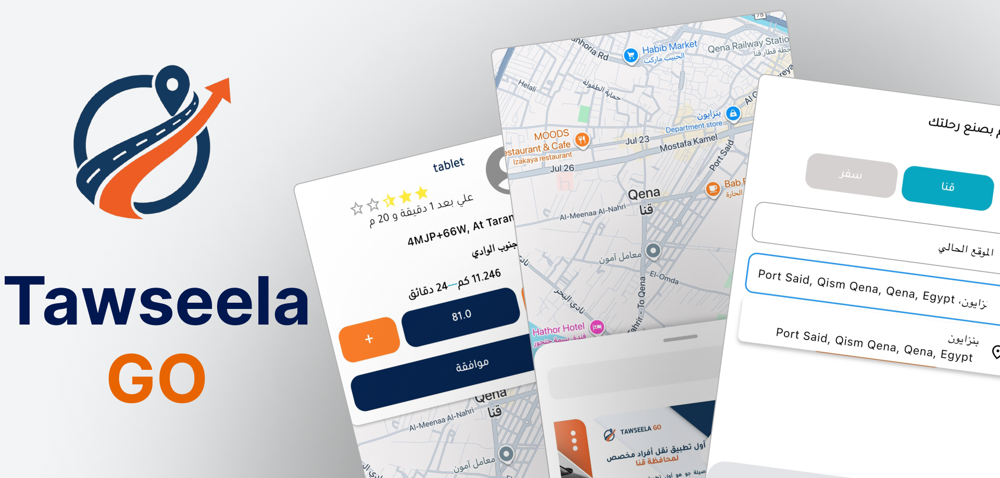
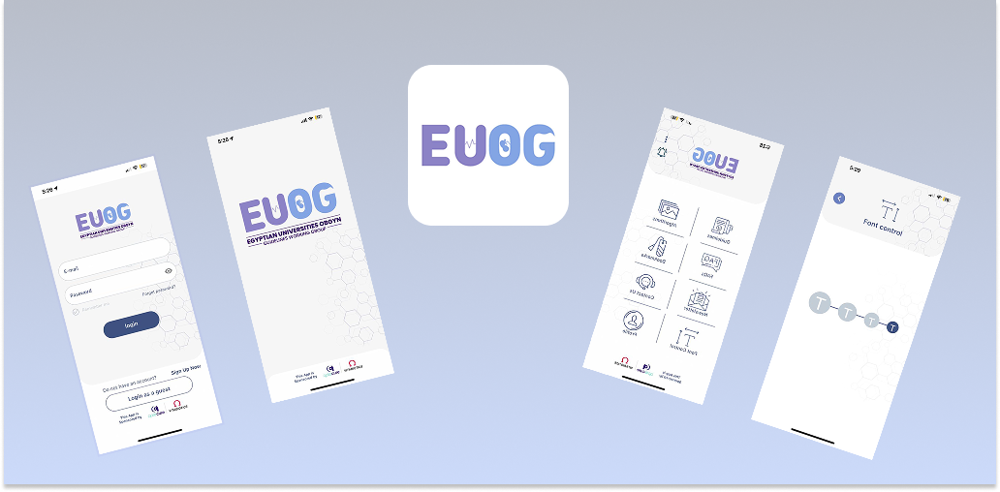
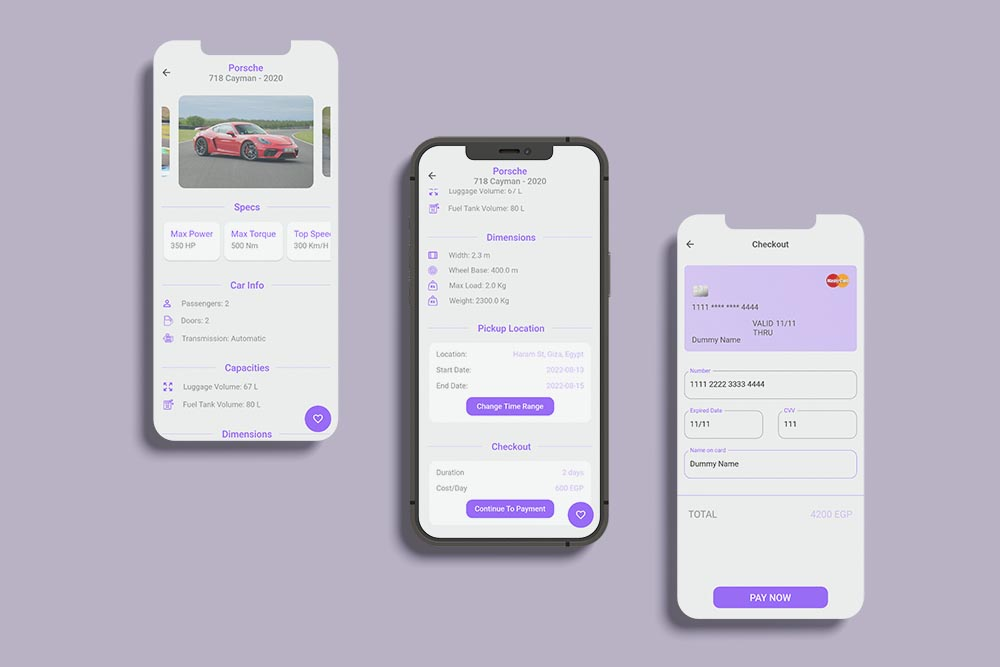

<h1 align="center">Hi 👋, I'm Yousra Khalifa</h1>
<h3 align="center">Senior Flutter Developer | AI-powered Mobile Applications</h3>

Flutter Developer with 4+ years of experience building scalable, high-performance mobile applications.  
Experienced in delivering production-ready apps published on Google Play, App Store, and AppGallery.

---

## 👩‍💻 About Me

- 📱 **Senior Flutter Developer** with 4+ years of experience in production mobile apps  
- 🏗️ Strong experience with **MVVM architecture & modern state management**  
- ⚡ Skilled in building **high-performance, scalable, and responsive applications**  
- 🔐 Experienced with **secure authentication** (Google, Apple, Facebook) and data encryption  
- ☁️ Strong backend integration with **REST APIs, Firebase, and cloud services**  
- 🤖 Building **AI-powered apps** using **GPT, LLaMA, and Gemini**  
- 🐳 Experienced with **Docker, Linux servers, and Python backend services**  
- 🚀 Passionate about **AI, emerging technologies, and innovative digital products**

---

# 📬 Connect With Me

- 💼 LinkedIn  
  https://www.linkedin.com/in/yousra-khaled-444651244/

- 📧 Email  
  yousrakhaled05@gmail.com

---

# 🚀 Featured Projects

## Zi Sushi
A full-featured food ordering app with real-time order tracking, push notifications, guest mode, and bilingual support
(Arabic & English) with light/dark themes and Implemented secure authentication (Google Sign-In, Apple Sign-In, login/registration).

---

## Tawseela Go
Tawseela is a full-featured ride-hailing app supporting user and driver accounts with profiles, vehicle management, trip requests,
real-time navigation, and trip history.

---

## Asda Al-Khaleej - أصداء الخليج
News application delivering real-time updates, articles, and notifications.

---

## Tabea - تابع
Power outage tracking application that helps users stay informed and prepared for electricity disruptions.

---

## EUOG
A medical application designed for obstetricians and gynecologists with articles, FAQs, and clinical algorithms.

---

## Car2Go
Car rental application project available on GitHub.

---

# 🛠️ Languages & Tools

---

⭐️ From [Yousra4](https://github.com/Yousra4)
