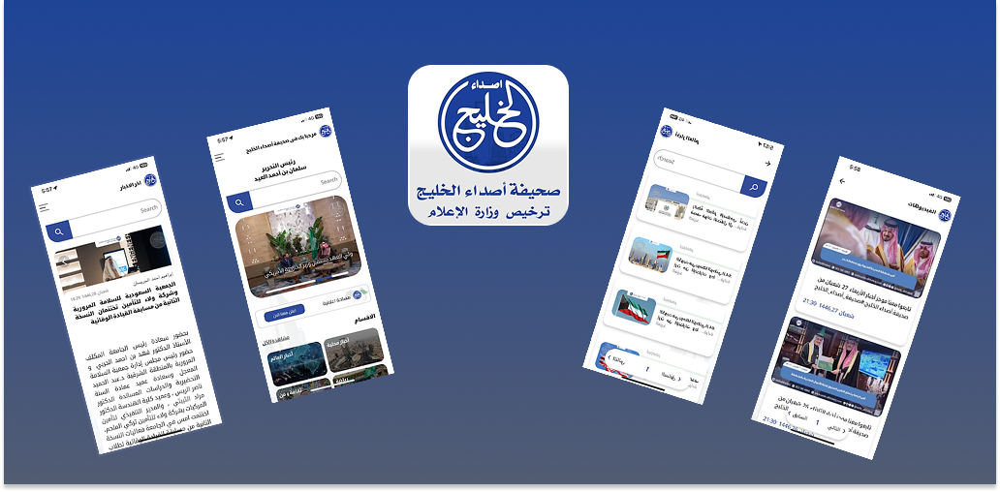

  - Results-driven Flutter Developer with 4+ years of experience delivering production grade mobile applications across
diverse industries.
  - Skilled in leading projects from architecture and design to deployment on Google Play, App Store, and
AppGallery while ensuring scalable, high-performance, and user-focused apps.
  - Expert in MVVM architecture, modern state management, responsive UI/UX, RESTful APIs, Firebase, and secure
authentication (Google, Apple, Facebook), with strong data security and encryption practices.
  - Hands-on experience building AI-powered apps using GPT, LLaMA, and Gemini, with expertise in Docker, servers, and
Python backend on Linux, enabling scalable AI and backend solutions even on non-Python environments.
  - A collaborative problem-solver passionate about emerging technologies and AI advancements, delivering innovative,
future-ready digital products that create meaningful user impact.

 
## Connect with me:
  - LinkedIn:   https://www.linkedin.com/in/yousra-khaled-444651244/
  - Email:      yousrakhaled05@gmail.com

<h3>Asda Al-Khaleej - أصداء الخليج</h3>

Asdaa Al-Khaleej is a user-friendly app with real-time news updates, and notifications
  

<h3>Tabea - تابع</h3>

Tabea is an Outage Tracker app - your ultimate solution to stay informed and prepared in the face of power distruptions.
  

